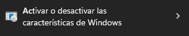

# Project Creation

## Introduction
In this part of the project we created the repository on GitHub and then we opened a GitHub Codespaces to modify and add new files to the project, the steps of the afore mentioned are described below

## Methods
### Project Requirements
To start this project we need to fulfill the following requirements: 

- Install Windows Terminal
- Install WSL on our computer (only if we have Windows 10 or Windows 11).
- Install Git.
- Install Node.js
- Have a GitHub account.

**What is WSL?**
WSL stands for "Windows Subsystem for Linux" (*Subsistema de Windows para Linux*) and is a feature of Windows 10 and 11 that allows running Linux applications directly on Windows without the need for a virtual machine or booting the Linux operating system.

**WSL installation guide**
1. Search for "Turn Windows features on or off" in the Start menu.



2. Click and wait for it load.
3. Verify that the following features are enabled: *Virtual Machine Platform* and *Windows Subsystem for Linux*.
4. If any of these features are not enabled, select them and click on "OK".
5. Wait for the process to finish, restart your computer, and verify that these two features are enabled.
6. Once these features are enabled, search for *PowerShell* in the Start menu.
7. Run *PowerShell* as an administrator.
8. Type the command `wsl --list` (it will show the distributions that we can download).
9. Choose Ubuntu using the command ```wsl --install -d Ubuntu```
10. Run the command ```wsl -l -v``` to list the distributions that we have installed.
11. To update to version 2, use the command `wsl --update`.
12. The command ```wsl --set-default-version2``` allows us to set version 2 as default.
13. To update the distribution, use the command `wsl --set-version Ubuntu 2`.
14. With this done, we proceed to open Ubuntu.
15. It will ask us for a username and password
16. Then we type the command `uname`, and if everything went well, we should see the word *Linux*

**Git Installation Guide**

1. Open the Ubuntu terminal.
2. Run ```sudo apt update``` to update the dependency repository info.
3. Run ```sudo apt install git-all```.
4. Make sure it is installed by running `git --version`.
5. Update your name and email by running the following commands:
 - ```git config --global user.name "Your Name"```
 - ```git config --global user.email "your_email@example.com"```

 **Node.js Installation Guide**

1. Open the Ubuntu terminal.
2. Run ```sudo apt-get install curl``` to install curl.
3. Run the following command to install NVM: "curl -o- [https://raw.githubusercontent.com/nvm-sh/nvm/v0.39.3/install.sh](https://raw.githubusercontent.com/nvm-sh/nvm/v0.39.3/install.sh) | bash"
4. Open a new tab in the terminal with "Ctrl + T" or close and reopen the Ubuntu terminal to load the new configuration.
5. Run ```nvm install --lts``` to install Node.js LTS.
6. Run `node --version` to verify that it installed correctly.

## Results
The results obtained from this are instructions on how to prepare a computer for a project. The requirements include installing WSL (if using Windows 10 or 11), Git, Node.js, and having a GitHub account. The guide then provides steps for installing WSL, including enabling the necessary features and selecting the Ubuntu distribution. After WSL is set up, the guide provides steps for installing Git and updating user information, followed by a Node.js installation guide using the NVM package manager. The guide concludes with a command to verify that Node.js is installed correctly.

## Discussions

- Users asking for clarification on certain steps, especially if they are not familiar with the tools or commands used.
- Users sharing their experiences with installing WSL or Git on different versions of Windows or Linux distributions, and offering advice or troubleshooting tips.
- Users discussing alternative tools or methods for setting up a development environment, such as using a virtual machine instead of WSL or using a different package manager to install Node.js.
- Users sharing their opinions on the usefulness or limitations of WSL, Git, or Node.js, and how they fit into the larger landscape of software development.

## References 
[Official WSL Guide in Spanish](https://learn.microsoft.com/es-es/windows/wsl/install)
[Official Git Guide in English]( https://git-scm.com/book/en/v2/Getting-Started-Installing-Git)
[Official Nodejs Guide in English](https://learn.microsoft.com/en-us/windows/dev-environment/javascript/nodejs-on-wsl)

[Back to PROJNOTES2023-a](https://github.com/AlexisFlo/PROJNOTES-2023a)